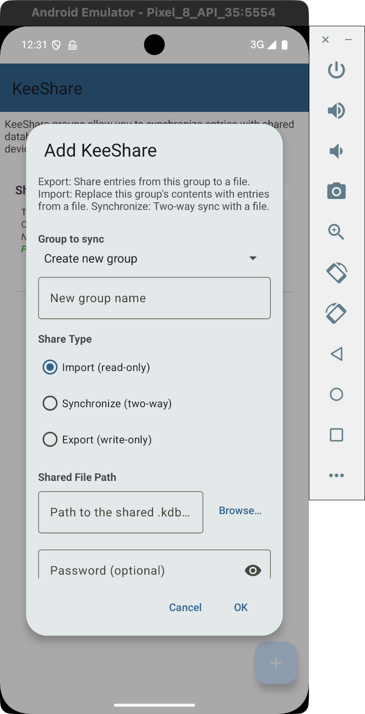
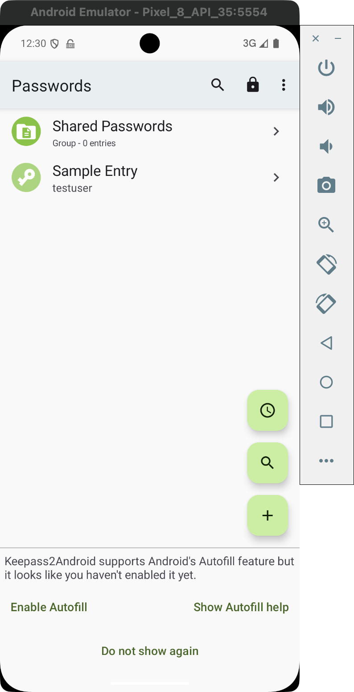
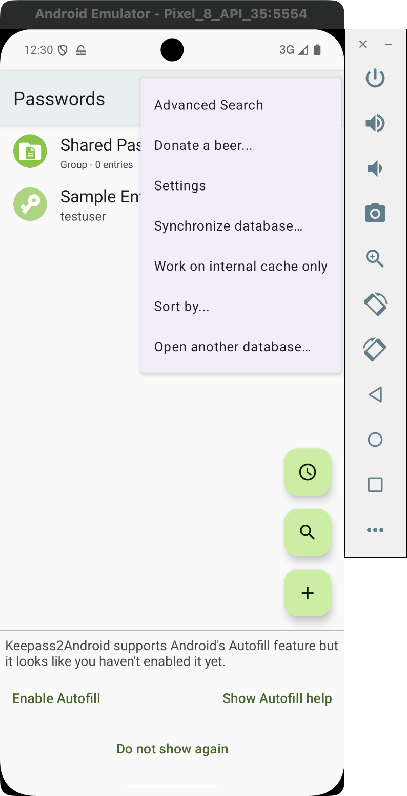
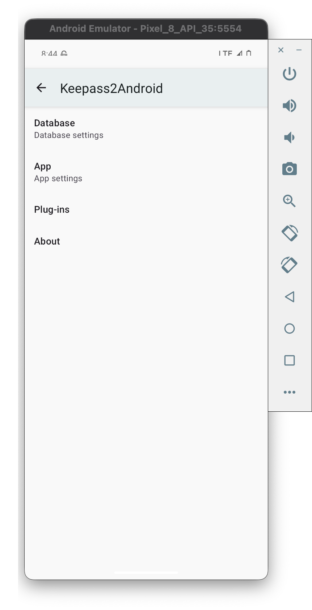
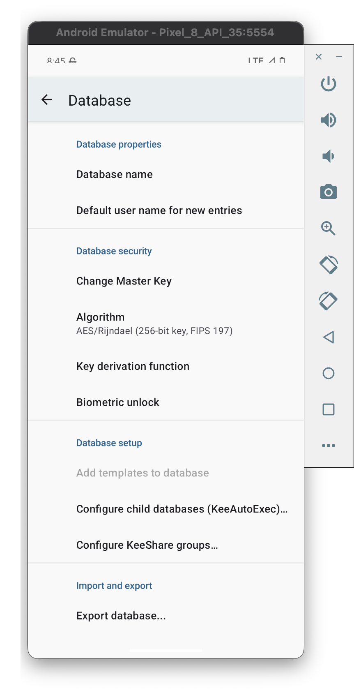
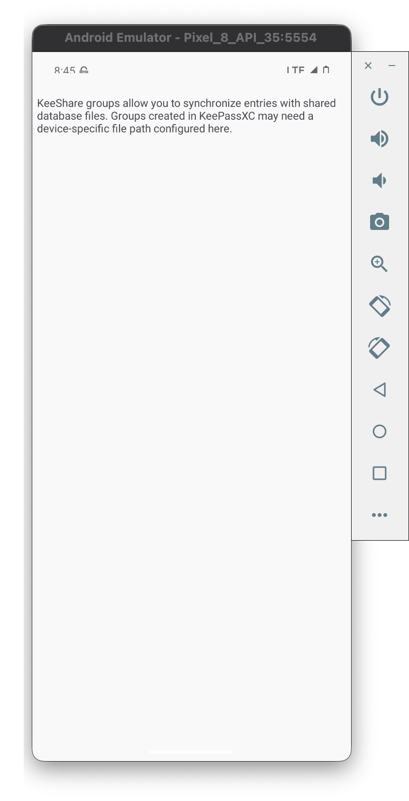

# KeeShare - Password Sharing for KeePass2Android

KeeShare enables secure sharing and synchronization of password entries between KeePass databases. Originally developed for [KeePassXC](https://keepassxc.org/docs/KeePassXC_UserGuide), this feature allows you to share subsets of your passwords with family members, team members, or synchronize between your own devices.

## Table of Contents

- [Overview](#overview)
- [How It Works](#how-it-works)
- [Sharing Modes](#sharing-modes)
- [Setup Guide](#setup-guide)
  - [Option A: Configure in KeePass2Android](#option-a-configure-in-keepass2android-recommended-for-mobile-only)
  - [Option B: Configure in KeePassXC First](#option-b-configure-in-keepassxc-desktop-first)
- [Security Considerations](#security-considerations)
- [Troubleshooting](#troubleshooting)
- [Testing the KeeShare Feature](#testing-the-keeshare-feature)

## Overview

KeeShare allows you to:

- **Share passwords** with other users via a shared container file
- **Synchronize entries** between multiple devices or databases
- **Import credentials** from shared databases created by others
- **Export credentials** to share with team members or family

Sharing is configured at the **group level** - when you enable KeeShare on a group, all entries within that group (and its subgroups) are included in the share.

> **Warning:** If you enable sharing on the root group, every password in your database will be shared!

## How It Works

```
┌─────────────────┐         ┌──────────────────┐         ┌─────────────────┐
│  Your Database  │ ──────► │ Shared Container │ ◄────── │ Other Database  │
│                 │         │   (.kdbx file)   │         │                 │
│  ┌───────────┐  │         │                  │         │  ┌───────────┐  │
│  │ Shared    │  │ Export  │  Stored on:      │ Import  │  │ Shared    │  │
│  │ Group     │──┼────────►│  - Cloud storage │◄────────┼──│ Group     │  │
│  │           │  │         │  - Network share │         │  │           │  │
│  └───────────┘  │         │  - Local folder  │         │  └───────────┘  │
└─────────────────┘         └──────────────────┘         └─────────────────┘
```

1. **Export**: Your shared group is written to a separate encrypted `.kdbx` file
2. **Storage**: The container file is stored in a location accessible to all parties (cloud storage, network share, etc.)
3. **Import**: Other databases read and merge entries from the shared container
4. **Synchronize**: Two-way sync keeps all databases up to date

## Sharing Modes

| Mode | Description | Use Case |
|------|-------------|----------|
| **Inactive** | Sharing disabled for this group | Temporarily pause sharing |
| **Import** | Read-only; pulls changes from shared file | Receive credentials from others |
| **Export** | Write-only; pushes changes to shared file | Share credentials with others |
| **Synchronize** | Two-way; both imports and exports | Keep multiple devices in sync |

### Mode Selection Guide

- **Personal sync between devices**: Use `Synchronize` on all devices
- **Team password sharing (one admin)**: Admin uses `Export`, team uses `Import`
- **Family sharing (equal access)**: Everyone uses `Synchronize`

## Setup Guide

There are two ways to set up KeeShare:

**Option A: Configure entirely in KeePass2Android** (new!)
- Create a new KeeShare import/export directly in the app
- Best for Android-only users or when you don't have access to KeePassXC

**Option B: Configure in KeePassXC first**
- Set up sharing in KeePassXC on desktop
- Configure device-specific paths in KeePass2Android
- Best when working across desktop and mobile

### Option A: Configure in KeePass2Android (Recommended for Mobile-Only)

You can now create KeeShare configurations directly in KeePass2Android without needing KeePassXC.

1. **Open your database** in KeePass2Android

2. **Navigate to KeeShare settings**:
   - Tap the menu (⋮) → **Settings** → **Database** → **Configure KeeShare groups...**

3. **Tap the + button** (FAB) in the bottom right corner

   

4. **Configure the KeeShare**:

   

   - **Group to sync**: Select an existing group or create a new one
   - **Share Type**: Choose Import, Export, or Synchronize
   - **Shared File Path**: Tap "Browse..." to select the shared `.kdbx` file
   - **Password**: Enter the password for the shared container (if any)

5. **Tap OK** to save the configuration

6. The entries will sync when you save your database

### Option B: Configure in KeePassXC (Desktop) First

If you're working with both desktop and mobile, you can configure KeeShare in KeePassXC first.

1. **Open your database** in KeePassXC on your computer

2. **Enable KeeShare** in settings:
   - Go to **Tools → Settings → KeeShare**
   - Check **"Allow import"** to receive shared credentials
   - Check **"Allow export"** to share your credentials

3. **Configure a group for sharing**:
   - Right-click on the group you want to share
   - Select **"Edit Group"**
   - Go to the **"KeeShare"** tab
   - Select the sharing mode (Import, Export, or Synchronize)
   - Set the **file path** for the shared container (use a cloud-synced folder like Dropbox, Google Drive, etc.)
   - Set a **password** for the shared container

4. **Save your database** - This creates the shared container file

### Step 2: Configure Device Paths in KeePass2Android

Since file paths on Android differ from desktop paths, you need to tell KeePass2Android where to find the shared container file on your device.

#### Opening the KeeShare Configuration

1. **Open your database** in KeePass2Android

   

2. **Open the menu** by tapping the three dots (⋮) in the top right

   

3. **Tap "Settings"**

   

4. **Tap "Database"** to access database settings

   

5. **Tap "Configure KeeShare groups..."**

   

#### Setting Device-Specific Paths

If you have groups configured for KeeShare (from KeePassXC), they will appear in the list. For each group:

1. **Tap "Configure path"** to set the Android-specific location of the shared container file

2. **Navigate to the shared file** on your device:
   - If using Dropbox: Look in `/storage/emulated/0/Dropbox/...`
   - If using Google Drive: The file may be in `/storage/emulated/0/Android/data/com.google/...`
   - If using a local folder synced via another method, navigate to that location

3. **Select the shared container file** (`.kdbx` file)

4. The path will be saved and sync will work on this device

#### Example Path Mappings

| Platform | Example Path |
|----------|--------------|
| Windows (KeePassXC) | `C:\Users\Me\Dropbox\Shared\team-passwords.kdbx` |
| macOS (KeePassXC) | `/Users/Me/Dropbox/Shared/team-passwords.kdbx` |
| Android (KeePass2Android) | `/storage/emulated/0/Dropbox/Shared/team-passwords.kdbx` |

All three paths point to the same Dropbox file, synced by the Dropbox app on each device.

## Security Considerations

### Password Protection

- The shared container file (`.kdbx`) is encrypted with the password you specify
- Use a **strong, unique password** different from your main database password
- Share the password securely (in person, encrypted message, etc.)
- Consider this password equally sensitive as your main database password

### Storage Location

- Choose a storage location you trust (your own cloud account, private network share)
- Shared container files contain real passwords - treat them with the same security as your main database
- Ensure cloud storage accounts have strong authentication (2FA recommended)

### Access Control

- Use `Import` mode for users who should only read passwords, not modify them
- Use `Export` mode to share without receiving changes from others
- Use `Synchronize` only when two-way sync is truly needed

### Encryption

- Shared containers use the same strong encryption as regular KeePass databases
- AES-256 encryption by default
- Key derivation function (Argon2) protects against brute-force attacks

## Troubleshooting

### "No KeeShare groups found" in KeePass2Android

This means no groups in your database have KeeShare configured. You need to:
1. Open the database in KeePassXC on your computer
2. Configure KeeShare on the groups you want to share
3. Save the database
4. Re-open it in KeePass2Android

### "Wrong password" or "master key is invalid" errors

This means the password configured for the KeeShare group doesn't match the password used to encrypt the shared container file.

**To fix:**

1. Go to **Settings** → **Database** → **Configure KeeShare groups...**
2. Find the KeeShare group showing the error
3. Check the password status indicator:
   - Orange text "Password: not set" = you need to set a password
   - Green text "Password: configured" = password may be wrong
4. Tap **Edit** to open the settings dialog
5. Enter the correct password (the one used when exporting from KeePassXC)
6. Tap **OK** to save
7. Tap **Sync now** to retry

**Note:** The password for the shared container is separate from your main database password. Make sure you're entering the password that was set when the KeeShare was originally configured in KeePassXC.

### Shared entries not appearing

1. Verify the device-specific path is correct and points to the shared container file
2. Check the password matches exactly (case-sensitive)
3. Ensure the sharing mode is set correctly (Import or Synchronize to receive)
4. Tap "Sync now" in the KeeShare configuration screen

### "File not found" errors

1. Check if the shared container file exists at the specified path
2. On Android, verify the app has storage permissions
3. For cloud storage, ensure the sync app has finished syncing the file
4. Try reconfiguring the device-specific path

### Sync conflicts

When the same entry is modified on multiple devices:
- KeeShare merges changes based on modification time
- The newer change wins
- Older data is preserved in the entry's history

### Permission issues on Android

1. Go to Android Settings → Apps → KeePass2Android → Permissions
2. Ensure Storage permission is granted
3. For Android 11+, you may need to grant "All files access" for some storage locations

### KeePassXC groups not showing in KeePass2Android

1. Make sure you saved the database after configuring KeeShare in KeePassXC
2. Close and reopen the database in KeePass2Android
3. Check that the groups have `KeeShare.Active = true` in their CustomData

## Testing the KeeShare Feature

This section describes how to manually test the KeeShare functionality and run the automated E2E tests.

### Test Files

The repository includes test files in `e2e-tests/test-data/`:

| File | Password | Description |
|------|----------|-------------|
| `keeshare-test-export.kdbx` | `TestKeeShare123!` | A KeeShare export containing test entries |
| `keeshare-test-main.kdbx` | `TestMain123!` | A main database for testing imports |

**Test export contents:**
- Group: `Shared Credentials`
- Entry: `Test Service Account`
  - Username: `testuser@example.com`
  - Password: `SharedPassword456!`
  - URL: `https://test.example.com`

### Manual Testing Steps

#### Prerequisites

1. An Android emulator or device with KeePass2Android installed
2. The test files copied to the device's Downloads folder

#### Setup

1. **Copy test files to the emulator:**
   ```bash
   adb push e2e-tests/test-data/keeshare-test-export.kdbx /sdcard/Download/
   adb push e2e-tests/test-data/keeshare-test-main.kdbx /sdcard/Download/
   ```

2. **Open KeePass2Android** and select the main test database:
   - Tap "Open file"
   - Navigate to Downloads
   - Select `keeshare-test-main.kdbx`
   - Enter password: `TestMain123!`

#### Test: Add KeeShare Import

1. Go to **Menu (⋮)** → **Settings** → **Database** → **Configure KeeShare groups...**
2. Tap the **+ button** (FAB) in the bottom right
3. Configure:
   - **Group**: Select "Create new group" and name it "Imported Credentials"
   - **Share Type**: Import (read-only)
   - **File Path**: Tap "Browse..." and select `keeshare-test-export.kdbx` from Downloads
   - **Password**: `TestKeeShare123!`
4. Tap **OK**
5. Verify the new KeeShare group appears in the list with:
   - Green "Password: configured" status
6. Tap **Sync now**
7. Navigate back to the database and verify the "Test Service Account" entry appears

#### Test: Wrong Password Error Handling

1. Go to **Configure KeeShare groups...**
2. Tap **Edit** on the KeeShare group
3. Change the password to something wrong (e.g., `wrongpassword`)
4. Tap **OK**, then **Sync now**
5. Verify you see a user-friendly error message about wrong password
6. Tap **Edit** again and fix the password to `TestKeeShare123!`
7. Tap **Sync now** and verify it succeeds

### Running Automated E2E Tests

The project uses [Maestro](https://maestro.mobile.dev/) for E2E testing.

#### Prerequisites

1. Install Maestro:
   ```bash
   curl -Ls "https://get.maestro.mobile.dev" | bash
   ```

2. Start an Android emulator or connect a device

3. Install the app:
   ```bash
   adb install -r src/keepass2android-app/bin/Release/net9.0-android/keepass2android.keepass2android_nonet-Signed.apk
   ```

#### Running the KeeShare Tests

```bash
# Run all KeeShare tests
maestro test e2e-tests/.maestro/keeshare_import_flow.yaml

# Run with verbose output
maestro test --debug-output e2e-tests/.maestro/keeshare_import_flow.yaml
```

#### Test Scenarios Covered

| Test File | Description |
|-----------|-------------|
| `keeshare_import_flow.yaml` | Complete flow: add import, set password, sync, verify entry |
| `keeshare_edit_password.yaml` | Edit existing KeeShare config to update password |
| `keeshare_wrong_password.yaml` | Verify error handling for wrong password |

### Creating Your Own Test Export

To create a test KeeShare export file in KeePassXC:

1. Open or create a database in KeePassXC
2. Create a group for sharing (e.g., "Test Share")
3. Add test entries to the group
4. Right-click the group → **Edit Group** → **KeeShare** tab
5. Select **Export** mode
6. Set the export path and password
7. Save the database

The export file will be created at the specified path and can be used for testing imports in KeePass2Android.

## References

- [KeePassXC KeeShare Documentation](https://github.com/keepassxreboot/keepassxc/blob/develop/docs/topics/KeeShare.adoc)
- [KeePassXC User Guide](https://keepassxc.org/docs/KeePassXC_UserGuide)
- [KeePass2Android Wiki](https://github.com/PhilippC/keepass2android/wiki)
