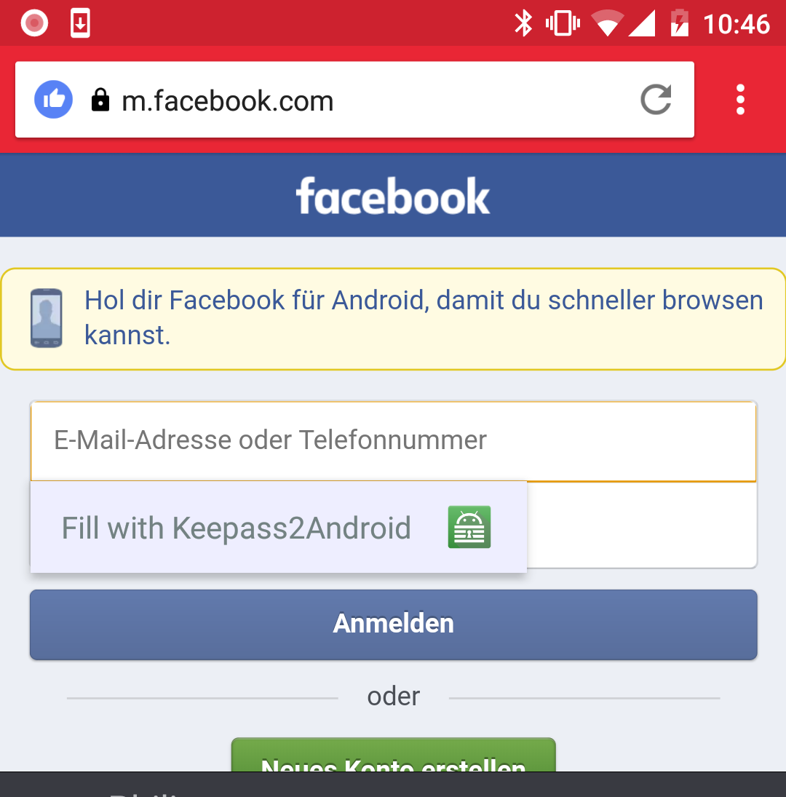

Google has introduced the Android Autofill interface in Android 8. Keepass2Android supports this interface. In most Android apps and all Autofill-enabled browsers, this is the most convenient way of entering passwords. As soon as you focus a field, you will see a popup "Fill with Keepass2Android".

After clicking this popup, you can unlock your KP2A database. If automatic look up succeeds, KP2A will close automatically, if not you are prompted to select the entry you want to auto-fill. When returning to the target app, the fields should be filled automatically already.

As of January 2018, the following browsers are known to have Android Autofill support:

* Firefox Focus / Firefox Klar
* Opera Mini

These browsers do not (yet) have autofill support:

* Google Chrome
* Firefox for Android ([bugzilla entry](https://bugzilla.mozilla.org/show_bug.cgi?id=1352011))
* Brave-Browser
* Opera

Please use the Share-URL-feature and the built-in KP2A keyboard for these browsers.

